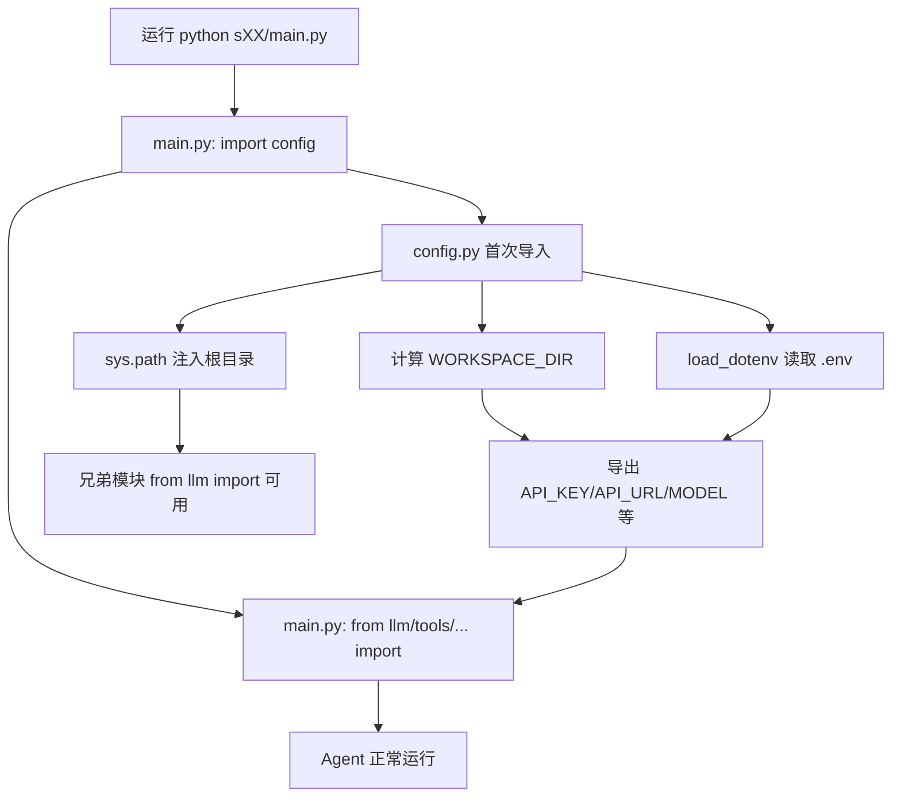

## 用户需求

使用 dotenv 优化代码：统一配置加载入口，消除各步骤 Python 文件中重复的 sys.path 注入 hack，确保 `.env` 通过 `load_dotenv` 被可靠加载。

## 产品概述

当前项目每个步骤（s01~s20）的入口 `main.py` 及内部子模块（llm.py、tools.py、teams.py 等）都各自重复 `sys.path.insert(0, 项目根目录)` 的导入 hack，并由 `config.py` 负责 `load_dotenv`。这种分散写法脆弱且冗余：当子模块被独立触发导入时，`load_dotenv` 可能因 `config` 未优先导入而错过 `.env`。本次优化将配置与路径加载收敛到唯一入口 `config.py`，全量移除所有文件中的 `sys.path` hack，使 dotenv 在任何导入顺序下都能可靠生效，同时保持每个步骤可独立运行。

## 核心特性

- 单一配置入口：`config.py` 在首次被导入时幂等地完成根目录计算、`load_dotenv`、sys.path 注入。
- 全量移除 hack：删除全部 main.py 与子模块中约 100+ 处的 `sys.path.insert/append(0, 根目录)` 重复代码。
- 兄弟模块导入归一：子模块统一改为顶部 `import config` 触发唯一入口，兄弟模块（如 `from llm import ...`）导入方式保持不变。
- 运行能力不变：每个步骤仍可通过 `python sXX_xxx/main.py` 独立运行，配置读取行为一致。

## 技术栈

- 语言：Python 3.10+
- 依赖：`python-dotenv`（已在 requirements.txt 声明）、`openai`
- 现有约定：所有步骤的 `main.py` 与子模块通过 `from config import API_KEY, ...` 读取配置，子模块间通过同目录 `from xxx import ...` 互相引用。

## 实现方案

### 策略概述

将"配置加载 + 路径注入"的唯一职责收敛到 `config.py`。`config.py` 在模块顶层（导入时）做三件事：计算 `WORKSPACE_DIR`、调用 `load_dotenv`、将根目录与当前步骤目录注入 `sys.path`。每个文件只需 `import config`（触发入口），即可保证 `.env` 已加载且 `sys.path` 已就绪，从而删除所有 `sys.path.insert` 重复代码。

### 关键技术决策

1. **config.py 幂等加载**：用模块级 `_initialized` 标志或 `load_dotenv` 本身的幂等性（同文件重复调用安全），并在 `config.py` 中一次性注入 `WORKSPACE_DIR` 到 `sys.path`。避免每个子模块重复 `sys.path.insert`。
2. **步骤目录 path 注入**：`main.py` 以 `python sXX_xxx/main.py` 运行时，脚本所在目录（步骤目录）已在 `sys.path[0]`（Python 自动加入），因此兄弟模块 `from llm import ...` 天然可用；子模块（被步骤目录内的文件 import）也继承该 path，无需各自 hack。为兼容"子模块被测试或工具直接导入"的边缘情况，在 `config.py` 中同时把 `WORKSPACE_DIR` 注入 `sys.path`，保证 `from config import` 一定成功。
3. **保持 `load_dotenv(override=False)`**：沿用现有语义（不覆盖已存在的 shell 环境变量），仅在 `config.py` 中保留，删除各子模块中遗留的重复 `load_dotenv`/path 代码（如有）。
4. **不触碰业务逻辑**：仅重构导入与路径加载，不改任何函数实现、不变更 `.env` 文件、不新增配置校验。

### 性能与可靠性

- `load_dotenv` 与 `sys.path.insert` 均为一次性、O(小文件) 操作，移除 100+ 处重复后反而降低导入开销与潜在重复插入。
- 幂等标志避免 `sys.path` 中出现重复根目录条目，防止 path 膨胀。
- 风险点：若某子模块在被 `main.py` 导入之前被外部工具链路提前导入，`config.py` 仍能独立完成 path 注入，比现状更健壮，不引入新脆弱点。

## 实现要点（执行细节）

- 根因：`sys.path.insert(0, os.path.dirname(os.path.dirname(os.path.abspath(__file__))))` 在每个 `main.py` 与子模块顶部重复出现（参考 s01/main.py:33、s20/main.py:3、s06/subagent.py:20）。统一删除。
- `config.py` 顶部保留并确保：先 `import os, sys` → 计算 `WORKSPACE_DIR` → `load_dotenv` → `sys.path.insert(0, WORKSPACE_DIR)`（去重判断）。
- 各 `main.py`：删除 `sys.path.insert` 行；保留 `from config import ...`，其本身即触发唯一入口，可放在 `from llm import ...` 之前即可。
- 各子模块：删除 `sys.path.insert` 行；在 `from config import ...` 之前（或任意位置但确保早于使用配置处）`import config`；兄弟模块导入 `from llm import ...` 保持不变。
- 批量操作：使用脚本/搜索替换一次性清理所有 `sys.path.insert(0, os.path.dirname(os.path.dirname(os.path.abspath(__file__))))` 及其上方孤立 `import os, sys` 中仅服务于该 hack 的部分（注意不要误删 `os`/`sys` 的真实业务使用）。

## 架构设计

### 配置加载数据流（优化后）



## 目录结构

## 目录结构摘要

本次为全量重构导入/路径加载，核心改动集中在 `config.py`（强化唯一入口）与 s01~s20 下每个 `main.py` 及各子模块（移除 sys.path hack）。以下列出关键文件，子模块文件按步骤目录批量处理。

mini-claude-python/
├── config.py                      # [MODIFY] 唯一配置/路径入口。确保首次导入时计算 WORKSPACE_DIR、load_dotenv、幂等注入 sys.path；保留现有配置导出。
├── s01_agent_loop/
│   ├── main.py                    # [MODIFY] 删除 sys.path.insert；保留 from config import。
│   ├── llm.py                     # [MODIFY] 删除 sys.path.insert；确保 import config 触发入口。
│   └── tools.py                   # [MODIFY] 删除 sys.path.insert；确保 import config。
├── s02_tool_use/ ... s20_comprehensive/
│   ├── main.py                    # [MODIFY] 同 s01 处理，删除顶部 sys.path hack。
│   ├── llm.py / tools.py / permission.py / hooks.py / teams.py / subagent.py /
│   │   skills.py / prompt.py / memory.py / recovery.py / protocols.py / cron.py /
│   │   compact.py / tasks.py / todos.py / background.py / worktree.py / mcp.py
│   │                             # [MODIFY] 各子模块顶部删除 sys.path.insert(0, 根目录) 重复代码；
│   │                                统一通过 import config 触发唯一入口（兄弟模块导入保持原样）。
└── requirements.txt               # [不动] python-dotenv 依赖已存在。

说明：s01~s20 共 20 个步骤目录，每个目录下含 1~18 个 .py 文件，全部需移除重复的 sys.path hack 并归一为 import config。文件总数约 200 个，其中含 sys.path.insert 的约 100+ 个需实质修改，无 sys.path 的文件无需改动。

## 关键代码结构（可选）

无需新增类型或接口；`config.py` 保持现有导出常量（`API_KEY`, `API_URL`, `MODEL`, `MAX_TOKENS`, `TEMPERATURE`, `WORKSPACE_DIR` 等）。其核心加载逻辑示意（仅描述，不新增 API）：

```python
# config.py 顶部（强化后）
import os, sys
WORKSPACE_DIR = os.path.dirname(os.path.abspath(__file__))
if WORKSPACE_DIR not in sys.path:
    sys.path.insert(0, WORKSPACE_DIR)
load_dotenv(os.path.join(WORKSPACE_DIR, ".env"), override=False)
# 随后 from config import * 在各模块可安全取得配置
```

## Agent Extensions

### SubAgent

- **code-explorer**
- 用途：在全量重构前，跨 s01~s20 所有目录精确检索所有 `sys.path.insert` / `sys.path.append` 出现位置及其上下文，确认是否有子模块在 `import config` 之外独立调用 `load_dotenv` 或依赖 path hack 的特殊导入。
- 预期结果：产出完整的待修改文件清单与每处 hack 的精确行号，避免遗漏或误删。